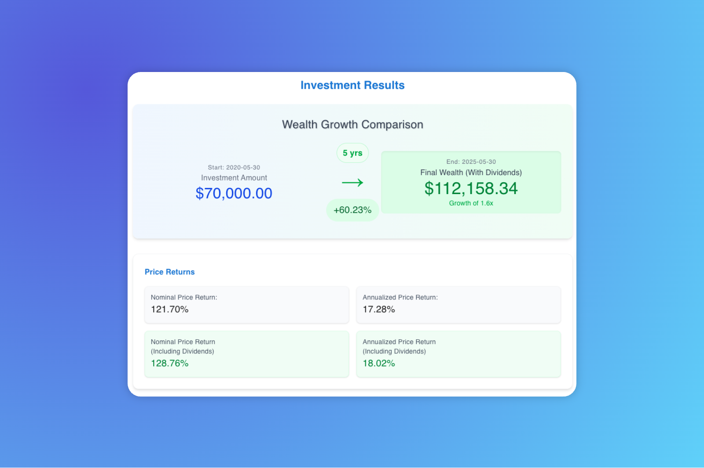
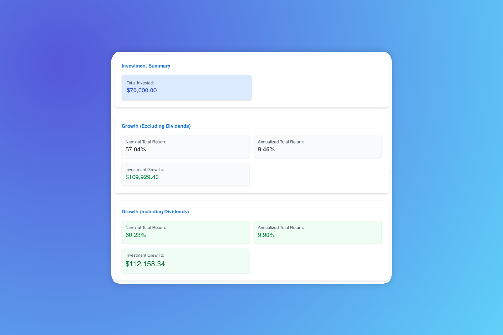
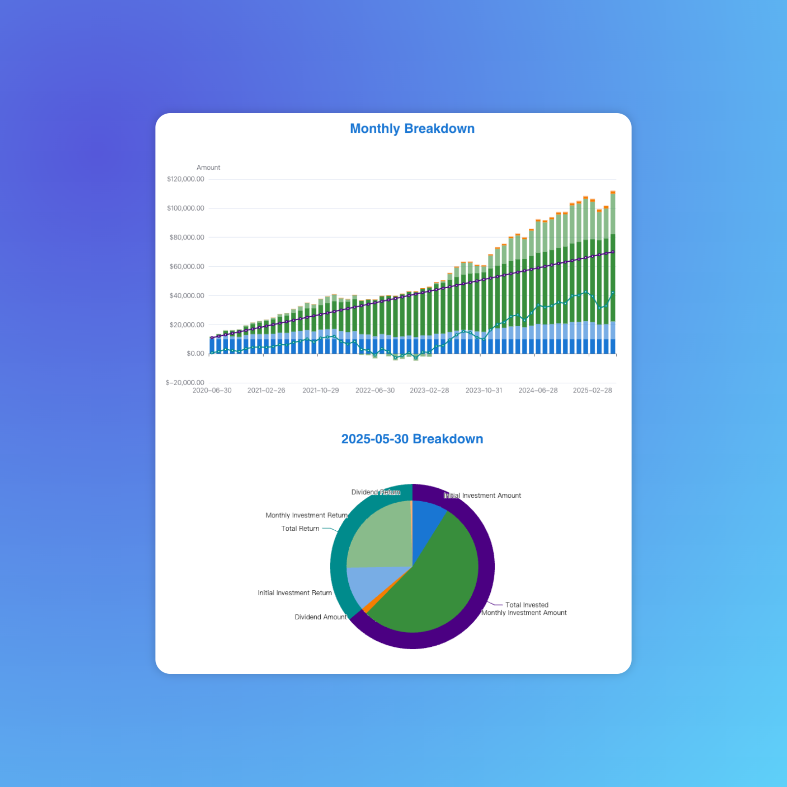

# QQQ Investment Calculator 📈💰

Welcome to the **QQQ Investment Calculator**, a web application designed to help you simulate and visualize potential returns on investments in QQQ (Invesco QQQ Trust, an exchange-traded fund based on the Nasdaq-100 Index). This tool allows you to input various investment parameters and see the projected growth over time.

## Overview

This application is built with [Next.js](https://nextjs.org/) and [React](https://reactjs.org/), providing a modern, responsive user interface for investment calculations. It leverages data visualization libraries like [ECharts](https://echarts.apache.org/) to display investment results and price trends.

## Features

- **Customizable Investment Parameters**: Set your initial investment amount, monthly investment contributions, and the time period for your investment.
- **Predicted Annualized Returns**: Choose from historical annualized returns over different periods (all-time, last 10 years, last 5 years) or input a custom rate.
- **Interactive Charts**: View your investment growth and QQQ price trends over the selected period with interactive charts.
- **Real-time Calculations**: Get instant feedback on potential returns based on your inputs through our API.

## Getting Started

### Prerequisites

- [Node.js](https://nodejs.org/) (version 16 or higher)
- [pnpm](https://pnpm.io/) package manager

### Installation

1. Clone the repository:
   ```bash
   git clone https://github.com/yourusername/invest-qqq-calculator.git
   cd invest-qqq-calculator
   ```

2. Install dependencies:
   ```bash
   pnpm install
   ```

3. Start the development server:
   ```bash
   pnpm dev
   ```

4. Open your browser and navigate to `http://localhost:3000` to see the application in action.

## Usage

1. **Set Date Range**: Choose the start and end dates for your investment period.
2. **Input Investment Amounts**: Enter your initial investment and monthly contribution amounts.
3. **Select Annualized Return**: Pick a historical return rate or enter a custom percentage.
4. **Calculate Returns**: Click on "Calculate Returns" to see the projected growth of your investment displayed in a chart.

## Screenshots

Here are some screenshots of the QQQ Investment Calculator in action:

- **Results Chart**: Visual representation of investment growth over time.
  
- **Summary View**: Overview of investment parameters and results.
  
- **Breakdown**: Detailed breakdown of investment returns.
  

## Project Structure

- `src/app/page.tsx`: Main application page where the investment form and results are rendered.
- `src/components/InvestmentForm.tsx`: Component for inputting investment parameters.
- `src/components/InvestmentResultsChart.tsx`: Displays the investment growth chart.
- `src/components/PriceChart.tsx`: Shows the QQQ price trend over the selected period.
- `src/app/api/cal/route.ts`: API endpoint for calculating investment returns based on user inputs.

## Contributing

Contributions are welcome! If you have suggestions for improvements or new features, please open an issue or submit a pull request.

## License

This project is licensed under the MIT License - see the [LICENSE](LICENSE) file for details.

## Contact

For any inquiries or support, please contact us at [your-email@example.com](mailto:your-email@example.com).

---

Happy Investing! 🚀